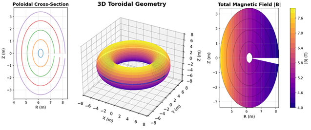
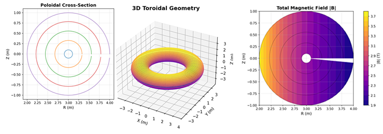
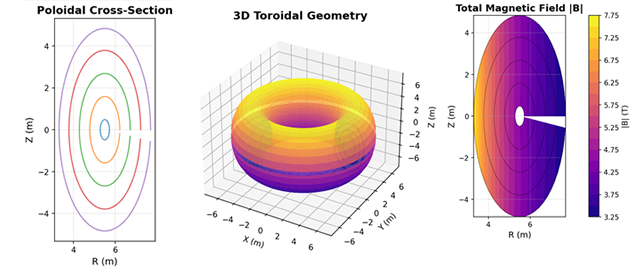

# Example Tokamak Grids

This directory contains example tokamak geometry grids generated with the **Chatwood Labs Axisymmetric Tokamak Grid Generator (v1.1-Public)**.

These examples demonstrate typical use cases and provide ready to use geometry files for BOUT++ 5.x simulations.

Each grid represents a different configuration commonly used in fusion research:

- a realistic **ITER-ish shaped** tokamak.
- a simple **circular analytic** reference tokamak
- an **extreme-shaping stress test** tokamak for solver validation

Only small preview images are included here.

Full diagnostic reports are generated internally and will be released with the upcoming
**Chatwood Labs Grid Diagnostics** package.

## 1. ITER-ish Shaped Tokamak
### File: ```bash grid_iterish_k1.7_d0.33.nc```

A large-aspect-ratio, moderately shaped tokamak loosely inspired by ITER geometry. Useful for turbulence studies, pedestal physics, and general BOUT++ edge simulations.

### Parameters:

- R₀ = 6.2 m
- a = 2.0 m
- κ = 1.7
- δ = 0.33
- B₀ = 5.3 T
- q-profile: cubic (q₀ = 1.05 -> qₐ = 3.5)
- Grid size: 64 × 64 × 64

### Preview:



### Generate with:

```bash
python bout_tokamak_grid_generator.py \
    --R0 6.2 --a 2.0 \
    --kappa 1.7 --delta 0.33 \
    --B0 5.3 --q0 1.05 --qa 3.5 --qform cubic \
    --nx 64 --ny 64 --nz 64 \
    --curvature exact \
    --outfile grid_iterish_k1.7_d0.33.nc
```

## 2. Circular Reference Tokamak
### File: ```bash grid_circular_reference.nc```

A clean, analytic, circular-cross-section tokamak. Ideal for verification, testing algorithms, and debugging physics without shaping effects.

### Parameters:

- R₀ = 3.0 m
- a = 1.0 m
- κ = 1.0
- δ = 0
- B₀ = 2.5 T
- q-profile: quadratic (q₀ = 1.0 -> qₐ = 3.0)
- Grid size: 64 × 64 × 64

### Preview:



### Generate with:

```bash
python bout_tokamak_grid_generator.py \
    --R0 3.0 --a 1.0 \
    --kappa 1.0 --delta 0.0 \
    --B0 2.5 --q0 1.0 --qa 3.0 --qform quadratic \
    --nx 64 --ny 64 --nz 64 \
    --curvature none \
    --outfile grid_circular_reference.nc
```

## 3. Extreme-Shaping Tokamak (Stress Test)
### File: ```bash grid_extreme_k2.2_d0.5.nc```

A highly elongated, strongly triangular tokamak. Designed to stress test solvers, metric calculations, and curvature-handling algorithms.

### Parameters:

- R₀ = 5.5 m
- a = 2.2 m
- κ = 2.2
- δ = 0.5
- B₀ = 4.5 T
- q-profile: cubic (q₀ = 1.1 -> qₐ = 4.0)
- Grid size: 80 × 80 × 64

### Preview:



### Generate with:

```bash
python bout_tokamak_grid_generator.py \
    --R0 5.5 --a 2.2 \
    --kappa 2.2 --delta 0.5 \
    --B0 4.5 --q0 1.1 --qa 4.0 --qform cubic \
    --nx 80 --ny 80 --nz 64 \
    --curvature exact \
    --outfile grid_extreme_k2.2_d0.5.nc
```

## Notes

- These grids were generated using the large-aspect-ratio analytic tokamak model included in the generator.
- X-points, diverted geometries, and full Grad–Shafranov reconstructions are not included.
- Additional examples and diagnostics will be provided once the **Chatwood Labs Grid Diagnostics** package is released.

## Reproducibility

All grids in this folder can be regenerated exactly using the commands above. If you modify parameters, consider documenting them to maintain reproducibility in your workflows.

## About Example Grid Resolutions

The example grids provided here use **reduced resolution (e.g., 64×64×64 or 80×80×64)** to keep file sizes manageable for GitHub and to ensure fast generation on typical laptops. These lower resolution grids preserve the geometric features of the full models but are not intended for high-fidelity simulation work.

For production runs, users should increase the grid dimensions (e.g., 128×128×128 or higher) according to their physics requirements and available computing resources.