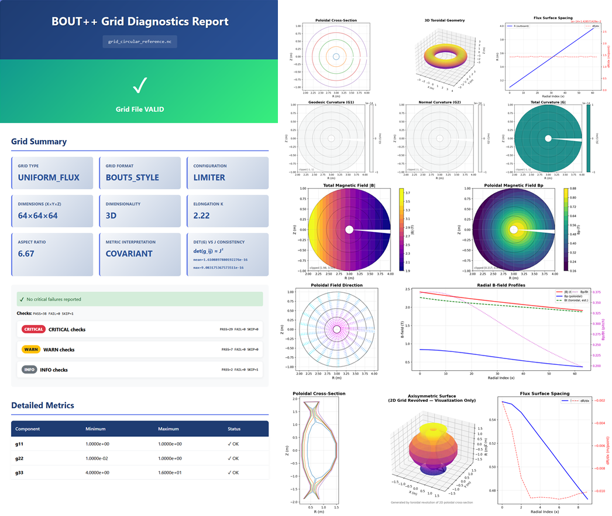

# BOUT++ Tokamak Grid Diagnostics Utility (**Version: 1.0.0 Public**)

[![CI][ci-badge]][ci-url] [![Python][py-badge]][py-url] [![License][license-badge]][license-url]

<!--
Badges:
- CI: GitHub Actions workflow status for this tool.
- Python: Declares the runtime baseline without duplicating your pyproject metadata.
- License: Quick visual confirmation this is MIT (because people are lazy and so am I).
-->

This script validates and visualizes **BOUT++ 4.x / 5.x** grid files, with a focus on **tokamak-style axisymmetric geometry**.

It was originally developed to validate grids generated by the Chatwood Labs **bout_tokamak_grid**, but it can be applied to **any BOUT++ grid file** (tokamak grids are simply the most common and best-supported case).

It performs **sanity checks** on geometry, metric tensors, Jacobians, and optional fields like magnetic geometry and shift angle, then produces:

- A **human-friendly HTML report** (verdict + summary + embedded plots)
- A **machine-friendly JSON report** (same base filename as HTML)
- Optional **PNG visualizations** of geometry and magnetic structure



This tool is designed to catch the most common **"grid looks fine until the solver explodes"** failure modes:

- Metric components that go non-positive or non-finite
- Jacobian sign flips or boundary singularities
- det(g) vs J inconsistencies (misinterpreted conventions or broken geometry)
- Shift angle non-monotonicity or 2π wrapping artifacts
- Under-resolved poloidal grids and poor metric conditioning

## Installation

Before running the script, ensure that the following dependencies are installed:

### Dependencies
- **NumPy**: For numerical computations and array handling.
- **xarray** (netCDF reading + dimension-safe handling)
- **NetCDF4**: For reading and writing netCDF files.
- **matplotlib** (plot generation; uses non-interactive backend)

To install the dependencies, run:

```bash
pip install numpy xarray netCDF4 matplotlib
```

Alternatively, you can install from `requirements.txt` (recommended for repeatable installs / CI):

```bash
pip install -r requirements.txt
```

### Optional: Install as a CLI tool (pip)

If this directory contains a `pyproject.toml`, the diagnostics tool can be installed as a command-line utility:

```bash
pip install .
```

This installs one or more console commands that invoke the same script logic, while still allowing direct execution via python bout_tokamak_grid_diagnostics.py.

To uninstall later:

```bash
pip uninstall bout-tokamak-grid-diagnostics
```

This installation method is optional and primarily intended for:

- repeatable CI environments
- developer workflows
- users who prefer a stable command name

### NetCDF backend note

This tool opens grids using **xarray**, which relies on one of its installed IO backends (typically `netcdf4` or `scipy`) to read NetCDF files.

If you pass a file that:
- isn’t NetCDF,
- has an unusual extension that prevents engine guessing,
- or requires a backend you haven’t installed,

the tool will fail cleanly with an `[ERROR]` message indicating it could not open the file with the installed backends.

### HPC / CI Environments - Matplotlib Cache Note

On first run, Matplotlib may attempt to build its font cache under:

```bash
$HOME/.cache/matplotlib
```

On some HPC systems, CI runners, or locked-down environments, this location may be read-only or unavailable, resulting in warnings or errors such as:

```bash
Matplotlib is building the font cache; this may take a moment.
```

or permission-related failures.

To avoid this, set the MPLCONFIGDIR environment variable to a writable location before running the diagnostics tool, for example:

```bash
export MPLCONFIGDIR=/tmp/$USER-mpl
```

or in CI:

```bash
export MPLCONFIGDIR=$PWD/.mpl-cache
```

This ensures Matplotlib can write its cache without polluting home directories or failing on restricted systems.

## Usage
### Command names

When installed via `pip install .`, the diagnostics tool can be invoked using either of the following commands:

```bash
bout-grid-diagnostics grid.nc
```

or:

```bash
bout-tokamak-grid-diagnostics grid.nc
```

Both commands invoke the same underlying diagnostics logic. The shorter name reflects the general applicability of the tool, while the longer name preserves its historical association with tokamak grid generation.

### Basic Usage

Run on a grid file and generate HTML/JSON + plots:

```bash
python bout_tokamak_grid_diagnostics.py path/to/grid.nc
```

If you run with no arguments, it will try grid.nc in the current directory. If the file is missing (or you pass a path that doesn’t exist), the tool fails cleanly with a clear [ERROR] message and a non-zero exit code (no Python traceback).

### Output control

```bash
# Write outputs into a chosen directory
python bout_tokamak_grid_diagnostics.py grid.nc --outdir diagnostics_out

# Disable plots
python bout_tokamak_grid_diagnostics.py grid.nc --no-plots

# Disable HTML (JSON still written)
python bout_tokamak_grid_diagnostics.py grid.nc --no-html

# JSON only (implies --no-html and --no-plots)
python bout_tokamak_grid_diagnostics.py grid.nc --json-only
```

### Strict mode

By default, warnings do not fail the run. Strict mode treats warnings as failures:

```bash
python bout_tokamak_grid_diagnostics.py grid.nc --strict
```

### Logging controls

```bash
# Only show warnings/errors
python bout_tokamak_grid_diagnostics.py grid.nc --quiet

# Verbose/debug output
python bout_tokamak_grid_diagnostics.py grid.nc --verbose

# Save logs to a file
python bout_tokamak_grid_diagnostics.py grid.nc --log-file diagnostics.log
```

## Exit Codes

The script uses an explicit exit code contract:

- **0** = grid passes all critical checks
- **1** = grid fails one or more critical checks (or warnings in --strict)
- **2** = partial grid / unsupported structure (detected earlier in the pipeline)

This makes it usable in CI pipelines and batch workflows.

## Outputs

By default, outputs are written next to the grid file (or into --outdir if provided):

- **\*_report.html** - interactive report with verdict + summaries + embedded plots
- **\*_report.json** - machine-readable validation results (same base name as HTML)
- **\*_render.png** - geometry visualization (flux surfaces, spacing diagnostics)
- **\*_bfield.png** - magnetic field structure visualization (if fields exist)

The JSON payload includes:

- Dimensions (nx, ny, nz), inferred grid format, dimensionality
- Configuration inference (tokamak-ish geometry heuristics)
- Lists of critical_failures and warnings
- A structured checks list with severity and details
- Key min/max statistics for g11/g22/g33, J, surfvol (if present), B (if present)
- Metric determinant consistency metadata (det(g) <-> J interpretation and errors)

## What Gets Checked

### 1. Basic grid structure and dimensions

- Detects 2D vs 3D grids, required variables, and missing/optional fields.

### 2. Metric tensor sanity

- Ensures metric components are finite (no NaN/Inf)
- Requires g11, g22, g33 > 0
- Applies a partial Sylvester-style check on the leading 2×2 minor: g11·g22 − g12² > 0
- Warns on poor conditioning via ratio tests (tunable threshold)

### 3. Jacobian sanity

- Jacobian sign consistency across the domain (BOUT++ 5.x does not require J > 0, but it must not flip sign)
- Boundary singularity detection via min(|J|) thresholds (tunable)

### 4. det(g) vs J consistency (convention defense)

Grids in the wild sometimes disagree on whether J corresponds to:

- J, 1/J, |J|, or det(g) conventions. This tool computes consistency metrics and reports mean/max relative error. Thresholds are tunable.

### 5. surfvol (optional)

- If present, checks sign consistency and surfvol/J finiteness
- If missing, warns and records that the check was skipped

### 6. Magnetic fields (optional)

If **Bxy** exists:
 
 - Checks positivity and reports min/max

If **Bpxy** exists:

 - Used for visualization and profile sanity plots

### 7. Shift field (optional)

Looks for shiftAngle or zShift:

- Tests monotonicity in y (poloidal index direction)
- For shiftAngle, also tests after unwrapping in y to avoid false failures from ±π phase wrapping
- Non-monotonic shift becomes a warning (or failure in --strict)

## Visualization Notes / Tokamak Assumptions

Some plots require choosing an **"outboard midplane"** index in the poloidal direction.
This tool uses a tokamak-centric heuristic:

- If a theta variable exists, it assumes theta ≈ 0 corresponds to outboard midplane
- Otherwise, it chooses the poloidal index where R is maximal at mid-radius

This is a reasonable diagnostic assumption for axisymmetric tokamak grids, but it is not universal for stellarators or strongly 3D equilibria. In those cases, treat the plots as qualitative.

## Known Limitations

- This is a grid diagnostics tool, not a replacement for full equilibrium validation.
- **"Outboard midplane"** is heuristic and may not correspond to a physically privileged location in non-tokamak configurations.
- Some checks are conservative by design; strict mode is intended for CI / regression testing.

## License

This software is released under the MIT License. Feel free to modify and redistribute it, but please provide attribution to Chatwood Labs Ltd.

## Contributing

Issues and pull requests are welcome.  
For large feature additions or major changes, please open an issue first to discuss the proposed implementation.

## Note on example reports

This repository includes example HTML/JSON diagnostics reports only. The underlying netCDF grid files are not included.

Report provenance:

- **expected_nonorthogonal.grd.nc, expected_orthogonal.grd.nc** Generated from grids in the Hypnotoad integrated test suite (https://github.com/boutproject/hypnotoad/).
- **d3d_119919.nc** Generated from grids in Hermes (https://github.com/boutproject/hermes). 
- **grid_circular_reference.nc, grid_extreme_k2.2_d0.5.nc, grid_iterish_k1.7_d0.33.nc** Generated using **bout_tokamak_grid_generator.py** from this repository (https://github.com/Chatwood-Labs/bout-tools/tree/main/bout_tokamak_grid).

These examples are intended to demonstrate the **structure and content of the diagnostics output**, not to provide canonical or physically realistic reference grids.

<!--
Badge link definitions.
-->

[ci-url]: https://github.com/Chatwood-Labs/bout-tools/actions/workflows/grid-diagnostics-tests.yml
[ci-badge]: https://github.com/Chatwood-Labs/bout-tools/actions/workflows/grid-diagnostics-tests.yml/badge.svg

[py-url]: https://www.python.org/downloads/
[py-badge]: https://img.shields.io/badge/python-3.10%2B-blue

[license-url]: LICENSE
[license-badge]: https://img.shields.io/badge/license-MIT-yellow
